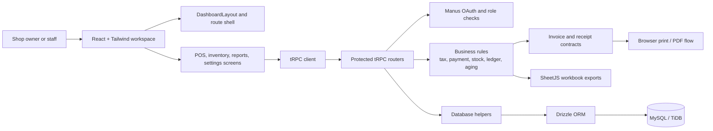
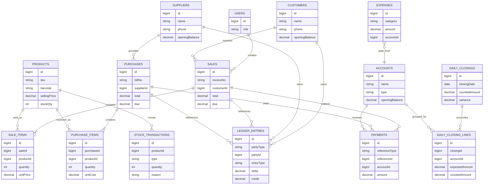

# Car Parts Inventory Ledger

A focused operations system for car parts and accessories shops. It brings sales, purchasing, inventory, customer and supplier ledgers, expenses, daily closing, reporting, and branded invoice printing into one workspace instead of scattering them across notebooks and disconnected spreadsheets.

The interface is designed for the counter team as well as the owner. A salesperson can find a part, scan a barcode, enter a customer by name and phone, collect a partial payment, and issue an invoice without forcing the customer into a pre-registration flow. Behind that simple path, the system keeps stock, payment, due, and ledger records connected.

## Objective

The objective is to give a small automotive retailer a dependable operational record for every sale and purchase. The system is intended to reduce stock uncertainty, make customer dues easier to follow, keep supplier payables visible, and give the owner a daily view of cash, digital collections, expenses, profit, and inventory health.

This is a business application rather than a generic dashboard demo. The important design decisions are around traceability, safe posting, role-aware access, and print-ready documents that can still be used at a physical counter.

## What is included

| Area | Coverage |
|---|---|
| Sales and POS | One-screen cart, customer name/phone entry, barcode lookup, discount, tax mode, partial payments, dues, returns, cancellations, and invoice preview |
| Product catalog | SKU, barcode, category, brand, part number, vehicle compatibility, purchase/selling price, minimum stock, rack location, and active/inactive status |
| Inventory | Current stock, low/out-of-stock warnings, stock valuation, adjustments with reason logging, and product movement history |
| Purchasing | Supplier selection, receiving, purchase payments, supplier payable, and purchase returns |
| Accounting | Customer/supplier running ledgers, payment accounts, expenses, cash book, daily closing, refunds, and variance reconciliation |
| Reporting | Sales, purchases, inventory, ledgers, cash book, expenses, profit, due aging, management summaries, date filters, Print/PDF flow, and Excel workbooks |
| Documents | Branded A4 invoices, Bengali/English labels, configurable tax, shop logo/details, 58mm and 80mm thermal receipts, and copyright footer |
| Operations | Five roles, protected procedures, audit logging, dashboard analytics, provider-neutral reminder guidance, and manual WhatsApp/SMS fallback |

## Tech stack

| Layer | Technologies |
|---|---|
| Frontend | React 19, TypeScript, Vite, Tailwind CSS 4, shadcn/ui, Recharts |
| API and server | Express 4, tRPC 11, SuperJSON, Manus OAuth |
| Data | Drizzle ORM, MySQL/TiDB, SQL migrations |
| Documents and exports | Browser print templates, SheetJS (`xlsx`), Bengali/English shared label contracts |
| Quality | Vitest, TypeScript checks, workflow verification, responsive browser review |

## Project screenshots

These frames were captured from the running application at a consistent desktop viewport. They show the main operating surfaces without relying on mock marketing copy.

| Screen | Preview |
|---|---|
| Business overview | [01-business-overview.png](./screenshots/01-business-overview.png) |
| Sales invoice and POS | [02-sales-invoice-pos.png](./screenshots/02-sales-invoice-pos.png) |
| Barcode quick sale | [03-barcode-quick-sale.png](./screenshots/03-barcode-quick-sale.png) |
| Purchasing and receiving | [04-purchasing-stock-receiving.png](./screenshots/04-purchasing-stock-receiving.png) |
| Inventory control | [05-inventory-control.png](./screenshots/05-inventory-control.png) |
| Products catalog | [06-products-catalog.png](./screenshots/06-products-catalog.png) |
| Customer directory | [07-customer-directory.png](./screenshots/07-customer-directory.png) |
| Customer due aging | [08-customer-due-aging.png](./screenshots/08-customer-due-aging.png) |
| Daily closing | [09-daily-closing-reconciliation.png](./screenshots/09-daily-closing-reconciliation.png) |
| Ledger accounts | [10-ledger-accounts.png](./screenshots/10-ledger-accounts.png) |
| Reports and analytics | [11-reports-analytics.png](./screenshots/11-reports-analytics.png) |
| Shop settings and branding | [12-shop-settings-branding.png](./screenshots/12-shop-settings-branding.png) |

## Project structure

```text
client/       React screens, layout, print templates, hooks, and UI components
server/       tRPC routers, database access, business rules, auth, and tests
shared/       Types, labels, calculation contracts, barcode and export helpers
drizzle/      Database schema, relations, migrations, and snapshots
docs/         Operational and integration documentation
screenshots/  Curated application screenshots used in this README
```

The main screen composition lives in `client/src/pages/Home.tsx`, the navigation shell is in `client/src/components/DashboardLayout.tsx`, the server contract is defined in `server/routers.ts`, and persistence/query logic is concentrated in `server/db.ts`.

## Application architecture

The application follows a typed client-to-server path. React screens call tRPC procedures; procedures apply role and input checks before calling database helpers; business helpers calculate tax, payments, balances, aging, and reconciliation; Drizzle persists the result in MySQL/TiDB. Shared contracts keep print labels, exports, barcode behavior, and status rules consistent between the UI and server.



More detail is available in [`docs/architecture.md`](./docs/architecture.md).

## Database model

The core data model separates master data from posted business documents and their accounting effects. A sale or purchase is not treated as a single number: it has line items, stock movements, payment records, and ledger entries that can be traced back through references.



The database view is also documented separately in [`docs/database.md`](./docs/database.md).

## Outcome

The result is a practical ledger and inventory workspace for a physical auto-parts shop. It supports the complete operational loop from catalog setup to sale, payment, stock movement, customer due, invoice printing, reporting, and daily reconciliation. The application has been checked with TypeScript validation, Vitest workflows, seeded persistence verification, and desktop/mobile route review.

The system intentionally keeps WhatsApp and SMS delivery provider-neutral. It records consent and reminder history and gives staff a manual copy/fallback flow instead of coupling the core ledger to one external messaging vendor.

## Local development

```bash
pnpm install
pnpm dev
```

Useful checks:

```bash
pnpm check
pnpm test
pnpm build
```

Configure the required environment variables through the runtime or deployment environment. Do not commit `.env` files, tokens, database credentials, or generated runtime artifacts.

## Author

Built and maintained by **Nazmus Sakib**.

- [GitHub](https://github.com/Nazmussakib247)
- [LinkedIn](https://www.linkedin.com/in/nazmussakib247/)

_All rights Reserve by Nazmus Sakib._
