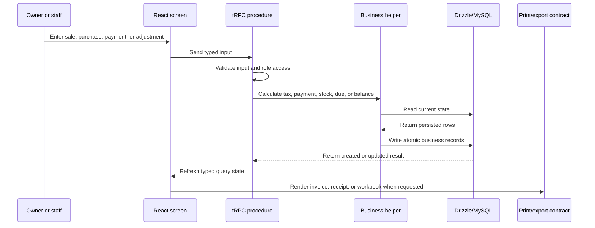

# Application Architecture

Car Parts Inventory Ledger is organized around a typed request path rather than a collection of ad-hoc REST endpoints. The browser owns the interaction model, tRPC carries typed requests, and the server applies authorization and business rules before any record is written.

## Request flow

## Responsibilities by layer

| Layer | Responsibility |
|---|---|
| React client | Screen layout, form state, search, barcode input, responsive tables, loading states, and print controls |
| Dashboard layout | Authentication-aware shell, role-aware navigation, profile access, and consistent workspace framing |
| tRPC procedures | Typed API contract, input validation, authorization, and orchestration of a business action |
| Business helpers | Deterministic tax, payment allocation, ledger balance, due aging, stock status, print, and export rules |
| Database helpers | Drizzle queries, aggregation, date-scoped reporting, and transaction-facing persistence operations |
| Shared contracts | Types and labels that must stay consistent between the browser, server, invoices, receipts, and exports |
| Database | Durable master data, documents, accounting effects, stock movements, settings, and audit records |

## Business posting model

A posted sale is deliberately represented as more than an invoice total. The sale has line items, a payment record when money is collected, stock transactions for each product, and ledger entries for the customer balance. Purchases follow the equivalent supplier and stock path. Returns and cancellations reverse the affected business effects rather than silently changing history.

This makes the operational screens useful for investigation: a customer due can be traced to ledger entries, a stock balance can be traced to movements, and a daily closing can be compared against the accounts that received the money.

## Authentication and authorization

Manus OAuth establishes the user session. Protected tRPC procedures receive the authenticated user through the server context, and role-aware procedures restrict sensitive operations such as catalog changes, adjustments, returns, cancellations, expenses, and settings updates. The client uses the same role information to avoid presenting navigation that the user cannot operate.

## External messaging boundary

The reminder workflow stores consent, message content, channel, and delivery history without making the core ledger dependent on WhatsApp or SMS. The provider guide is intentionally separate from the accounting flow, so an installation can choose a provider or use the manual copy fallback later.
