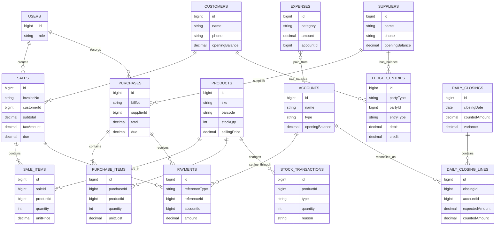

# Database Model

The schema is designed around a simple rule: a business event should leave enough evidence to explain what changed. Master records describe products, customers, suppliers, users, and payment accounts. Transaction records describe sales, purchases, expenses, payments, stock movements, ledger entries, returns, and daily closing.

## Relationship view



## Important persistence choices

**Sales and purchases are document headers with line items.** This keeps the document total separate from the products and quantities that produced it. Product-level stock movement can therefore be reported without reconstructing the original invoice manually.

**Payments are linked to accounts.** Cash, bank, mobile money, and card collections can be reconciled by channel. Expense outflows use the same account model, which lets daily closing compare expected movement with the counted result.

**Ledgers are chronological.** Customer and supplier balances are built from dated debit and credit entries with references back to the originating sale, purchase, payment, return, or adjustment.

**Daily closing is additive.** A closing record stores the selected business date, channel-level expected movement, counted amount, notes, and variance. Saving a closing does not erase the underlying sales, expenses, refunds, or payments.

**Settings are persisted separately.** Shop identity, logo, tax mode, invoice language, receipt preferences, and provider-neutral reminder settings can change without changing historical transaction rows.

## Migration workflow

Schema changes start in `drizzle/schema.ts`. A migration is generated with Drizzle, reviewed, and applied to the configured MySQL/TiDB database. Application code should not assume that a column exists until the migration has been applied to the target environment.

```bash
pnpm drizzle-kit generate
pnpm check
pnpm test
```

Never commit connection strings, JWT secrets, OAuth credentials, or `.env` files. The database is the source of truth for business data; generated runtime files and local development logs are intentionally outside the repository.
